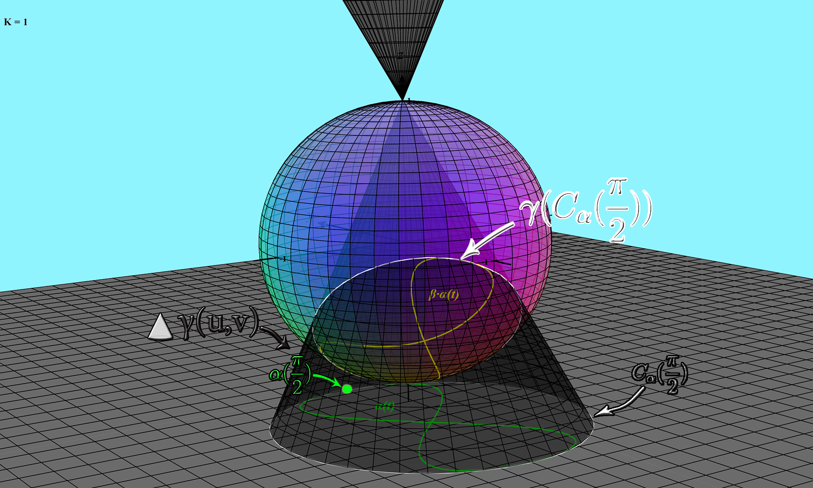

```sh
     \\XXXXXX//  Dynamical Systems
      XXXXXXXX Built From Curvature  
     //XXXXXX\\  and Torsion of      OOOOOOOOOOOOOOOOOOOO
    ////XXXX\\\\  Planar Curves      OOOOOOOOOOOOOOOOOOOO
   //////XX\\\\\\     |||||||||||||||OOOOOOOOOOOOOOOVVVVVVVVVVVVV
  ////////\\\\\\\\    |!!!|||||||||||OOOOOOOOOOOOOOOOVVVVVVVVVVV'
 ////////  \\\\\\\\ .d88888b|||||||||OOOOOOOOOOOOOOOOOVVVVVVVVV'
////////    \\\\\\\d888888888b||||||||||||            'VVVVVVV'
///////      \\\\\\88888888888||||||||||||             'VVVVV'
//////        \\\\\Y888888888Y||||||||||||              'VVV'
/////          \\\\\\Y88888Y|||||||||||||| .             'V'
////            \\\\\\|iii|||||||||||||||!:::.            '
///              \\\\\\||||||||||||||||!:::::::.
//                \\\\\\\\           .:::::::::::.
/                  \\\\\\\\        .:::::::::::::::.
                    \\\\\\\\     .:::::::::::::::::::.
                     \\\\\\\\
```
Stereographic Projection is a smooth bijective mapping from a plane to a sphere. The mapping is a conformal projection preserving angles and circles. That is the image of a circle on the sphere is a circle in the plane and the angle between two lines on the sphere is the same as the angle between their images in the plane. A smooth curve lying on the plane can be projected to the sphere. Any smooth planar curve has zero torsion and some curvature. As a result of the preservative properties of the projection mapping we are able to make a bijective mapping of the curvature and torsion of a curve to the curvature and torsion of its projected image. Such mapping allows for a dynamical system to be built. Each iterate of the system takes in a smooth parametric planar curve and outputs a smooth parametric curve. The parametric curve created from the output of each iterate is defined by the mapping of the projected curvature and torsion of the input curve. </br>

## Mathematical Formalization
This repository builds the core foundational logic to build a dynamical system from mapping of curvature and torsion of image of parametric planar curve when stereographically projected to the unit sphere. </br>

### Projection
Let $\alpha(t)$ be a an arbitrary parametric curve residing the plane $z=-1$. This will be the seed to our dynamical system. Suppose we have some mapping $\beta: \mathbb{R}^2->\mathbb{R}^3$ such that $\beta(\alpha(t))$ represents the [stereographic projection](https://en.wikipedia.org/wiki/Stereographic_projection) of $\alpha(t)$ onto the unit sphere. 
Such that 
```math
\begin{equation}
    \beta \cdot \alpha(t) = \beta \cdot \alpha \begin{pmatrix}
    x(t)\\
    y(t)\\
    \end{pmatrix}=\begin{pmatrix}
    \frac{4x(t)}{x(t)^2+y(t)^2+4} \\
    \frac{4y(t)}{x(t)^2+y(t)^2+4} \\
    \frac{x(t)^2+y(t)^2-4}{x(t)^2+y(t)^2+4}
    \end{pmatrix}
    
\end{equation}
```
Notice first that this projection $\beta(\alpha(t))$ now has some [curvature](https://mathworld.wolfram.com/Curvature.html) $\kappa(t)$ & some [torsion](https://mathworld.wolfram.com/Torsion.html) $\tau(t)$. But it doesn't seem obvious how to derive $\kappa(t)$ & $\tau(t)$..🧙‍♂️


### Mathematical Derivation of the Curvature and Torsion of Stereographic Projection
Notice that from the curvature of the planar curve $\alpha(t)$ at any point $t_0$ along $\alpha$ we know that $\alpha(t_0)$ has some associated curvature, and therefore an osculating circle lying on the plane and intersecting $\alpha$ at a single point $\alpha(t_0)$. If you are not familiar, this circle represents the instantanious "curvature" at $t_0$. Imagine you are driving a car along the curve and following the twists and turns until at $t_0$ you hold the steering wheel at exactly the same angle and keep driving. What would happen is you would trace out a circle! And the inverse of the radius of that circle we call curvature🙌. We will call that circle $c_{\alpha}(t)$. We will use $c_{\alpha}(t)$ as the base of an oblique cone, and the tip of the cone will be the north pole of the unit sphere. We will show that the intersection of this cone with the unit sphere is in fact the osculating circle of $\beta(\alpha(t))$. </br>

#### 🍦 The Cone 🍦
Let $\beta: \mathbb{R}^2\rightarrow{}S^2-{N}$ be a stereographic projection. Let $\alpha$ be a planar curve in $\mathbb{R}^2$ lying on the plane $z=-1$. Let $\beta \cdot \alpha(t)$ be the image of $\alpha$ on the unit sphere. Suppose $c_{\alpha}(t)$ represents the osculating circle along the curve $\alpha$. Let  $\gamma :\mathbb{R}^2\rightarrow{}\mathbb{R}^3$ be a parametric surface of an oblique cone. The surface $\gamma \cdot c_\alpha$ will represent represent an oblique cone with base $c_\alpha$, and vertex the north pole of the unit sphere. Let $\alpha(t_0)$ be some point along the curve $\alpha$. 

 We propose that the intersection of $\gamma \cdot {c_\alpha(t_0)}$ with the unit sphere defines the osculating circle of $\beta \cdot \alpha(t_0)$. That is, the intersection of $\gamma \cdot {c_\alpha(t_0}$ will be the osculating circle of the image of $\alpha$ on the unit sphere. Hence, the Frenet apparatus $T,N,B$ is preserved and such intersection will yield the curvature of the image of $\alpha$. The torsion of the image of $\alpha$ can be found utilizing a differential equation which will hold true for all curves contained on the surface of a sphere. 
 
 Let $r(t)= \frac{1}{\kappa(t)}$ be the radius of the projected osculating circle of $\alpha$ at any point $t$. Where $\kappa(t)$ defines curvature of the image of $\alpha$ at some point $t$. Then, by a defining property of spherical curves we have that the following differential equation:

$$r(t)^2+\frac{(r'(t))^2}{\tau(t)^2}=1$$
   
will always be satisfied. Where $\tau$ is the torsion of the image of $\alpha$ along the parameter $t$. Hence, the torsion of the image of $\alpha$ can be calculated by simply differentiating $r(t)$ and solving the equation above for $\tau$.

#### 🍦Cone Formal Definition🍦
Let $\gamma_{C_{\alpha(t_0)}}: \mathbb{R}^2\rightarrow{}S^2-{N}$ be defined as follows:
```math
\begin{equation}
\gamma_{C_{\alpha(t_0)}}(u,v)= \begin{pmatrix}
x(u,v) \\
y(u,v) \\
z(u,v)
\end{pmatrix}= \begin{pmatrix}
v(x_0 + rcos(u))\\
v(y_0 + rsin(u))\\
1-2v
\end{pmatrix}
\end{equation}
```
Where $0\leq v \leq 1$ and $0\leq u \leq2\pi$. $\gamma$ can be defined as the surface of a cone from $(0,0,1)$ to the the plane $z=-1$ s.t. $(x_0,y_0)$ is the center of the osculating circle of $\alpha$ and $r$ is the radius of the osculating circle of $\alpha$ at $t=t_0$. Notice when $v=1$ we have the following:
```math
$$\gamma_{C_{\alpha(t_0)}}(u,v)= \begin{pmatrix}
(x_0 + rcos(u))\\
(y_0 + rsin(u))\\
-1
\end{pmatrix}$$
```

Hence the intersection of the cone with the plane $z=-1$ gives us the osculating circle of $\alpha$ at $t=t_0$. Notice $\alpha'(t)=\frac{T(t)}{\parallel T(t) \parallel} =$ the unit tangent vector of $\alpha$ at $t=t_0$. Further $N(t) =\frac{T'(t)}{\parallel T' \parallel}$. So, we have $\kappa(t)=\parallel T'(t) \parallel$ = Curvature of $\alpha(t)$. Since $1/\kappa(t) = r$ of $C_\alpha (t)$ and $N(t) =\frac{T'(t)}{\parallel T' \parallel}$. We have $\frac{T'(t)_x}{\parallel T' \parallel} =x(t) + \frac{T'(t)_x}{\kappa(t)}$ and 
$y_0 = y(t) + \frac{T'(t)_y}{\parallel T' \parallel} =y(t) + \frac{T'(t)_y}{\kappa(t)}$.

The intersection of the cone defined by $\gamma$ with the unit sphere will be the points that satisfy
```math
$$(v(x(t) + \frac{T'(t_0)_x}{\kappa(t_0)} + rcos(u))^2+(v(y(t) + \frac{T'(t_0)_y}{\kappa(t_0)} + rsin(u))^2+(1-2v)^2=1$$
```

For more technical details as to how the intersection is derived read the paper. But, if you want to just take my word for it the intersection of $\gamma$ and the unit sphere will be:
```math
\begin{equation}
 \gamma_{C_{\alpha(t_0)}}(u,v^*)= \begin{pmatrix}
\frac{4(x(t) + \frac{T'(t_0)_x}{\kappa(t_0)} + \frac{1}{\kappa(t_0)}cos(u))}{(x(t) + \frac{T'(t_0)_x}{\kappa(t_0)}+\frac{1}{\kappa(t_0)}cos(u))^2+(y(t) + \frac{T'(t_0)_y}{\kappa(t_0)}+\frac{1}{\kappa(t_0)}sin(u))^2+4}\\
\frac{4(y(t) + \frac{T'(t_0)_y}{\kappa(t_0)} + \frac{1}{\kappa(t_0)}sin(u))}{(x(t) + \frac{T'(t_0)_x}{\kappa(t_0)}+\frac{1}{\kappa(t_0)}cos(u))^2+(y(t) + \frac{T'(t_0)_y}{\kappa(t_0)}+\frac{1}{\kappa(t_0)}sin(u))^2+4}\\
1-\frac{8}{(x(t) + \frac{T'(t_0)_x}{\kappa(t_0)}+\frac{1}{\kappa(t_0)}cos(u))^2+(y(t) + \frac{T'(t_0)_y}{\kappa(t_0)}+\frac{1}{\kappa(t_0)}sin(u))^2+4}
\end{pmatrix} 
\end{equation}
```

which yields the equation of the osculating circle of $\beta \cdot \alpha(t)$ at $t=t_0$. From this we can smoothly derive the projected curvature and torsion in 3 dimensional space of the projection. The details of this derivation are clearly defined in the paper.

Here is a graphic of all of the components: </br>
<p align="center">
  
</p>
We can notice something very interesting the curvature $\kappa(t)$ and torsion $\tau(t)$ actually trace a smooth planar curve in the same parametric form as our original seed $\alpha(t)$, Let $\phi(t)=[\kappa(t),\tau(t), -1]$ be such curve. This represent the output of the first iterate, and the input to the second iterate of our dynamical system. The dynamical system will continue this methodology by iteratively projecting the output of each iterate and reprojecting downward the curvature and torsion in the form $[\kappa(t),\tau(t), -1]$. This is the iterative architecture of the system built in this repository. 

## Research Goals

## Analysis of Families of curves. 

Let $f: \mathbb{R}^2->\mathbb{R}^2$ is defined as $f^1(\phi(t)) = \phi^1(t)=[\kappa^1(t),\tau^1(t), -1]$ where $\kappa(t)$ and $\tau(t)$ represent the curvature and torsion of the image of $\phi^0(t)$ on the unit sphere. Then $f^n(\phi(t)) = \phi^n(t)=[\kappa^n(t),\tau^n(t)]$ would be the $n_{th}$ iterate of $f$ which would be the result of stereographically projecting $[\kappa(t),\tau(t),-1]$ and recalculating the projected curvature and torsion over $n$ iterates.

## The behavior I am hoping to Analyze

**Try to find fixed points in the system --> if $\phi(t) =[x(t),y(t), -1]$ then if $f(\phi(t))=\phi^1(t)$ we have $\phi^1(t)=[\kappa(f(\phi(t)),\kappa(f(\phi(t))]=\phi(t)$. The above result would be the case when $\phi(t)$ represents a planar parametric circle, but is there other cases where this could be true? To be honest, I am not sure.. but I want to know 🧙‍♂️🧙‍♂️.**
</br>

**Does convergence happen for some curves over an orbit of high order. Further what is the curve that the orbit of 
$f^n(\phi(t))$ is converging to. Is it always the same cure? Is it a circle? And what topological inferences could we learn from such a result. **
</br>

**Does chaos ever arise in such a system? My intuition tells me no, but to be completely honest this is just a hunch.**
</br>

**Categorizing behavior of families of curves in the dynamical system based on the results.**

For a comprehensive mathematical formulation of the equations reference 


